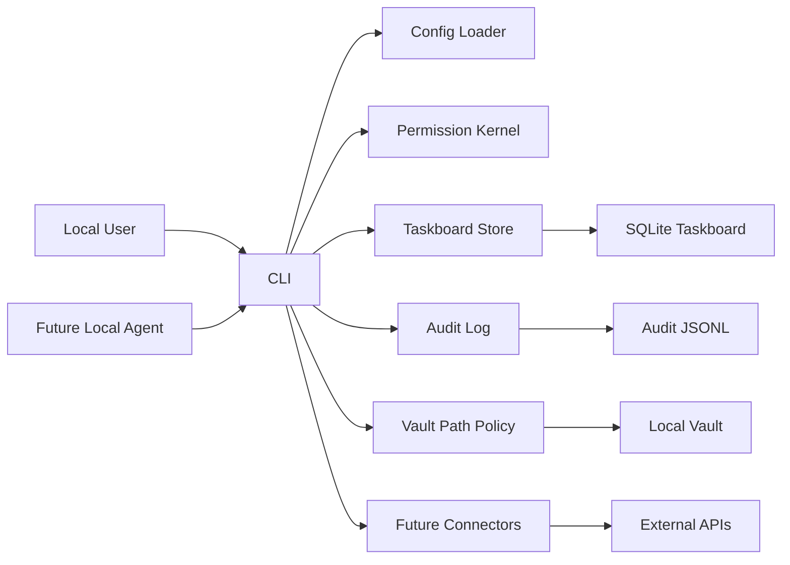

# il_segretario Threat Model

## Executive summary

`il_segretario` is a local-first, single-user CLI custodian for an Obsidian-compatible vault. The highest-risk areas are vault privacy boundaries, task lifecycle enforcement, audit tamper resistance, and future connector/tool execution paths. Phase 0 already establishes useful controls: local config defaults, permission decisions, task state transitions, path traversal rejection, redacted audit events, and hash-chain verification. The main residual risk is that audit logs are not yet resistant to a malicious local writer who can rewrite both event and chain files.

## Scope and assumptions

In scope:

- Runtime Phase 0 code under `src/segretario/`.
- Tests under `tests/`.
- Bootstrap/config files: `pyproject.toml`, `segretario.yaml.example`, `.env.example`, `.gitignore`, `README.md`.

Out of scope for this Phase 0 model:

- Real Gmail, Calendar, WebConnector, scheduler, LLM calls, vault ingest/query, and autonomous agents. These are scaffolded or planned, not implemented.
- Network-exposed service behavior. Current implementation is CLI/local library code.

Assumptions:

- Deployment is local, single-user.
- A future local agent may query `il_segretario`; `il_segretario` remains the enforcement boundary and should answer through controlled interfaces.
- The vault may contain highly sensitive personal notes, email/calendar-derived content, and OAuth credentials paths.
- Audit should resist malicious local tampering as a security objective, not merely accidental corruption detection.
- `TaskboardStore` is not the policy brain, but it is an enforcement boundary for task state integrity: all task status changes must go through store transition methods.

Open questions that could change risk:

- What OS-level storage controls should be acceptable for malicious-local audit resistance: Windows ACLs, append-only external sink, signed checkpoints, or hardware-backed keys?
- Will the future querying agent run under the same local user account or a distinct OS identity?

## System model

### Primary components

- CLI entrypoint: `segretario.cli:app` exposes local commands such as `status` and `config show`.
- Config loader: `segretario.config.loader.load_settings` reads YAML and `SEGRETARIO_*` environment overrides.
- Permission kernel: `segretario.policies.permissions.PermissionKernel` maps action constants to `allow`, `confirm`, `deny`, or `project`.
- Privacy/path policy: `segretario.vault.paths.classify_vault_path` and `segretario.policies.privacy.knowledge_export_decision` classify vault paths and exportability.
- Taskboard store: `segretario.taskboard.store.TaskboardStore` owns task creation, confirmation, deny, lease, failure, and retry transitions.
- Audit log: `segretario.audit.hash_chain.AuditLog` writes redacted events and hash-chain records.
- Placeholders: `app/core.py`, `app/router.py`, `agents/`, `tools/`, `connectors/`, and `scheduler/` define future boundaries but do not yet execute side effects.

### Data flows and trust boundaries

- User CLI -> Typer CLI: command arguments and config path cross from operator-controlled shell into application code. Channel: local process argv/env. Controls: Typer parsing; output stays local.
- Environment/config -> Settings: YAML and environment variables cross into runtime configuration. Channel: local filesystem/env. Controls: Pydantic validation and explicit override order in `load_settings`.
- CLI/Core future -> PermissionKernel: requested actions become policy decisions. Channel: in-process API. Controls: explicit action constants; unknown actions denied.
- CLI/Core future -> TaskboardStore: task requests and lifecycle transitions become SQLite rows. Channel: local file/SQLite. Controls: status enum validation, high/critical tasks enter `waiting_confirmation`, approval rejects non-confirmation tasks, leases and retry limits are store-managed.
- CLI/Core future -> AuditLog: action metadata and payload summaries become JSONL records. Channel: local filesystem. Controls: recursive key-based redaction, event hash, chain hash, verification.
- Vault path input -> Path/privacy classifiers: user/agent-supplied vault-relative paths become privacy/export decisions. Channel: in-process API. Controls: `..` traversal rejection, `self/` local-only, `privacy_map.local.json` no-export, `raw/elaborati` skip.
- Future connectors -> external services: Gmail/Calendar/Web are planned but not implemented. Channel: future local OAuth/HTTP clients. Controls required by spec: confirmation gates, projections, redaction, and audit.

#### Diagram

## Assets and security objectives

| Asset | Why it matters | Security objective (C/I/A) |
| --- | --- | --- |
| Vault `self/` content | Personal local-only data; no-export by design | C/I |
| `meta/privacy_map.local.json` | Token mapping can reidentify projected data | C/I |
| Knowledge pages | May contain sensitive or local-only material | C/I |
| Taskboard SQLite | Controls high-risk confirmations, leases, retries, and task state | I/A |
| Audit JSONL and hash chain | Evidence of actions and permission outcomes | I/A |
| Google credentials/token paths | Future OAuth credentials and tokens | C/I |
| Config/env overrides | Can redirect vault, audit, model, and connector behavior | I |
| CLI output | Could leak private paths, tokens, or protected content | C |
| Future connector calls | Can send mail, alter calendar, fetch web content | C/I/A |

## Attacker model

### Capabilities

- Local user or local process can invoke CLI commands and supply paths, config paths, and environment variables.
- Future local agent can query `il_segretario` and may provide untrusted prompts, paths, or task requests.
- A malicious local process may read/write files accessible to the same OS user unless OS controls prevent it.
- Future web/email/calendar data may be attacker-influenced when connectors are implemented.

### Non-capabilities

- No remote internet attacker can directly reach Phase 0 because no server is exposed.
- No multi-tenant boundary exists in Phase 0.
- Future external APIs cannot receive vault-private context unless connector features are implemented and called.

## Entry points and attack surfaces

| Surface | How reached | Trust boundary | Notes | Evidence |
| --- | --- | --- | --- | --- |
| CLI `status` | `uv run segretario status` | Shell -> CLI | Reads config and probes local status without failing on missing services | `src/segretario/cli.py` / `status` |
| CLI `config show` | `uv run segretario config show` | Shell -> CLI | Prints resolved config; must not print secret contents | `src/segretario/cli.py` / `config_show` |
| Config loading | YAML/env | Local files/env -> Settings | Env vars override YAML; config can redirect sensitive paths | `src/segretario/config/loader.py` |
| Permission decisions | In-process caller | Core/tool request -> policy | Unknown actions denied; private web context requires projection | `src/segretario/policies/permissions.py` |
| Vault path classifier | In-process caller | User/agent path -> privacy decision | Rejects parent traversal; marks protected paths | `src/segretario/vault/paths.py` |
| Knowledge export decision | In-process caller | Page metadata -> exportability | Requires `privacy: public` and `cloud_ok: true` | `src/segretario/policies/privacy.py` |
| Taskboard transitions | In-process caller | Action request -> SQLite state | Enforces confirmation states, leases, retries | `src/segretario/taskboard/store.py` |
| Audit append/verify | In-process caller | Event metadata -> JSONL files | Redacts sensitive keys and verifies hash chain | `src/segretario/audit/hash_chain.py` |
| Future connectors | Planned | Local process -> external APIs | Not implemented; must route through PermissionKernel, TaskboardStore, and AuditLog | `src/segretario/connectors/__init__.py` |

## Top abuse paths

1. Goal: exfiltrate `self/` data. Steps: future agent supplies a crafted path -> path classifier/export logic misclassifies it -> connector receives private content -> impact: local-only data leaves the machine.
2. Goal: bypass confirmation. Steps: caller writes task status directly or uses permissive transition -> high-risk mail/calendar/file action runs as queued -> impact: unauthorized side effect.
3. Goal: hide malicious action. Steps: local process modifies audit event and hash-chain files -> recomputes chain or deletes evidence -> impact: audit record is untrustworthy.
4. Goal: poison configuration. Steps: caller sets `SEGRETARIO_CONFIG` or path env vars -> app uses attacker-chosen vault/state paths -> impact: wrong vault processed, audit/taskboard redirected, or privacy controls bypassed operationally.
5. Goal: leak secrets through logs/output. Steps: future connector includes token/email body in audit payload -> redaction misses key variant or value pattern -> impact: secrets or private content stored in logs.
6. Goal: monopolize autonomous work. Steps: future agent creates many failing/running tasks -> leases/retries/cooldowns are weak -> impact: local availability degradation.
7. Goal: send private context to web. Steps: future web query depends on vault-private context -> projection step skipped -> WebConnector sends raw context externally -> impact: privacy boundary failure.

## Threat model table

| Threat ID | Threat source | Prerequisites | Threat action | Impact | Impacted assets | Existing controls (evidence) | Gaps | Recommended mitigations | Detection ideas | Likelihood | Impact severity | Priority |
| --- | --- | --- | --- | --- | --- | --- | --- | --- | --- | --- | --- | --- |
| TM-001 | Future local agent or operator input | Vault-relative paths are accepted before file IO | Supply traversal or protected paths to export/read/write flows | Private vault content may be exposed or modified | `self/`, privacy map, knowledge pages | `classify_vault_path` and `knowledge_export_decision` reject `..`; `self/` local-only; privacy map no-export | Future file IO must always call these classifiers before access | Centralize path resolution in VaultTool; require relative paths; verify resolved path stays under vault root; add integration tests for every file-reading tool | Audit denied path decisions; count traversal rejections | Medium | High | High |
| TM-002 | Buggy or malicious local caller | Caller can access TaskboardStore or SQLite | Bypass confirmation or mutate task state outside transition methods | High-risk actions could execute without approval | Taskboard SQLite, Gmail/calendar/file actions | Store enforces high/critical waiting confirmation; `approve_task` rejects non-confirmation tasks; leases/retries managed by store | Direct SQLite writes remain possible under same OS user; Core integration not implemented | Keep SQLite private to process/user; do not expose raw connection; add Core APIs only; add tests forbidding direct status updates outside transition methods; record audit refs on terminal transitions | Audit every transition; periodic invariant scan for impossible states | Medium | High | High |
| TM-003 | Malicious local process | Attacker can rewrite audit files | Rewrite both event and chain files or delete evidence | Audit cannot prove what happened | Audit JSONL/hash chain | Hash-chain verification detects simple tampering | Does not resist malicious rewrite by same OS user; no signed checkpoint or append-only storage | Add keyed HMAC or signatures with key outside audit directory; periodic signed checkpoints; Windows ACL hardening; optional external append-only mirror; verify command with alerting | Audit verify failures; missing sequence numbers; checkpoint mismatch | Medium | High | High |
| TM-004 | Operator error or malicious local process | Env/config path can be supplied | Redirect vault/state/config paths | App may operate on wrong vault, lose audit locality, or hide state | Config, vault, taskboard, audit | Explicit config path and env override support; status prints resolved paths | No confirmation for config/policy modifications yet beyond PermissionKernel constants | Require confirmation task for persistent config changes; warn when env overrides active; canonicalize and display all resolved state paths | Audit config source and env override presence | Medium | Medium | Medium |
| TM-005 | Future connector or agent code | Sensitive payload enters audit append | Store token/email/private content in audit | Secrets or private content persist locally | OAuth tokens, email bodies, self content, audit logs | Recursive redaction covers common key variants like token/secret/auth/credential/apiKey | Value-pattern redaction and protected-content hashing are not complete; no payload size/classification guard | Store hashes for sensitive payloads by default; add denylist for protected path contents; redact bearer/JWT/email patterns; add tests for OAuth and email payloads | Scan audit for secret patterns; assert max payload sizes | Medium | High | High |
| TM-006 | Future WebConnector flow | Query is derived from private vault context | Skip privacy projection and send raw context to web | External privacy leak | Vault-private notes, self profile, knowledge pages | PermissionKernel returns `PROJECT` for private-context web query; privacy policy has projection decision | No WebTool integration yet | Make WebTool require projection object, not raw string, for private context; audit projection hash; test `self/` never appears in web payload | Audit web query decisions; rejected raw-private web attempts | Medium | High | High |
| TM-007 | Future scheduler/agent loop | Autonomous tasks can enqueue more tasks | Create unbounded retries or long-running leases | Local resource exhaustion; stale taskboard | Taskboard, local compute | Store has leases and retry limit behavior | Cooldowns/budgets not implemented in Phase 0 | Enforce scheduler budgets, cooldowns, max tasks per cycle; detect recursive task creation | Metrics for queued/running/failed counts and lease age | Low | Medium | Medium |
| TM-008 | Future Gmail/Calendar caller | Connector mutating action is requested | Send mail, modify/delete calendar, archive/delete messages | External irreversible side effects | Gmail, Calendar, user reputation/time | PermissionKernel confirms sensitive actions; taskboard supports waiting confirmation | Real connector wrappers not implemented | Implement tools as only side-effect layer; require task approval id and audit linkage before mutation | Audit all connector mutations; list pending confirmations | Medium | High | High |

## Criticality calibration

- Critical: direct export of `self/` or `privacy_map.local.json`; confirmed Gmail send/calendar delete without user approval; pre-auth remote execution if a server is ever added.
- High: bypassable task confirmation; audit rewrite that hides sensitive actions; raw private context sent to web; OAuth token leakage into logs.
- Medium: config redirection causing operation on wrong local vault; autonomous retry loop consuming local resources; partial knowledge export mistake where content is sensitive but not from absolute no-export paths.
- Low: status showing missing optional local services; placeholder modules being lightly referenced; local-only URL examples such as Ollama localhost.

## Focus paths for security review

| Path | Why it matters | Related Threat IDs |
| --- | --- | --- |
| `src/segretario/cli.py` | CLI entrypoint and output boundary | TM-004, TM-005 |
| `src/segretario/config/loader.py` | Config/env override trust boundary | TM-004 |
| `src/segretario/config/settings.py` | Default paths and future connector config | TM-004, TM-008 |
| `src/segretario/policies/permissions.py` | Central action allow/confirm/deny/project decisions | TM-002, TM-006, TM-008 |
| `src/segretario/policies/privacy.py` | Knowledge export and web projection decision support | TM-001, TM-006 |
| `src/segretario/vault/paths.py` | Vault path classification and no-export rules | TM-001 |
| `src/segretario/taskboard/store.py` | Confirmation gates, leases, retries, and task lifecycle integrity | TM-002, TM-007, TM-008 |
| `src/segretario/audit/hash_chain.py` | Audit redaction and tamper evidence | TM-003, TM-005 |
| `src/segretario/app/core.py` | Future integration point for PermissionKernel, TaskboardStore, AuditLog, and tools | TM-002, TM-005, TM-008 |
| `src/segretario/tools/` | Future side-effect boundary | TM-001, TM-006, TM-008 |
| `src/segretario/connectors/` | Future OAuth/web/API clients | TM-005, TM-006, TM-008 |
| `tests/` | Regression evidence for privacy and state invariants | All |

## Quality check

- Covered discovered entry points: CLI status/config, config/env loading, permission kernel, path/privacy classifiers, taskboard transitions, audit append/verify, future connectors.
- Covered each trust boundary at least once in threats: CLI input, env/config, taskboard SQLite, audit files, vault paths, future external APIs.
- Separated runtime from future/unimplemented connectors and scheduler.
- Reflected user clarifications: local single-user, possible future local querying agent, TaskboardStore as state enforcement boundary, audit malicious local tamper resistance as a desired objective.
- Open questions are explicit and tied to risk ranking.
